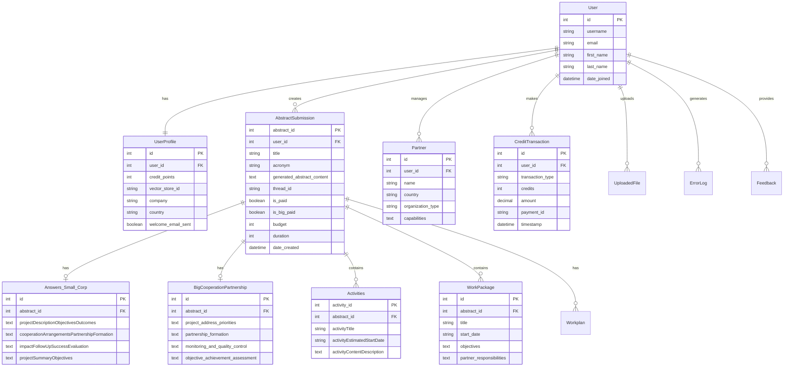

# Database Schema Analysis - Get Your Grant

**Document Purpose**: Comprehensive analysis of current database schema, data models, and relationships for Get Your Grant 2.0 rebuild planning.

**Analysis Date**: 2025-01-07 12:16:00 UTC  
**Analyst**: AI Development Team  
**Status**: Phase 1, Task 1.1.4 - Current Database Schema Analysis

---

## Executive Summary

The current Get Your Grant database uses PostgreSQL with Django ORM, implementing a comprehensive schema for grant proposal management. The schema supports two partnership types (Small-scale and Big cooperation) with distinct data models, user management with credit systems, partner management, and payment tracking. While functionally complete, the schema has scalability limitations, missing indexes, and lacks support for advanced features like collaboration, version control, and comprehensive analytics.

### Key Findings
- **Database**: PostgreSQL with Django ORM
- **Core Models**: 15+ models covering users, projects, responses, activities, payments
- **Relationships**: Well-defined foreign keys with proper cascade handling
- **Limitations**: No collaboration support, limited analytics, missing indexes
- **Scalability Issues**: Single-tenant design, no partitioning, basic optimization

---

## Database Architecture Overview

### Technology Stack
- **Database Engine**: PostgreSQL 12+
- **ORM**: Django ORM (Django 5.1)
- **Connection Pooling**: Basic Django connection handling
- **Caching**: Redis for session and application caching
- **Migrations**: Django migrations system

### Schema Organization
```
Database: getyourgrant_production
├── Authentication & Users
│   ├── auth_user (Django built-in)
│   ├── assistant_userprofile
│   └── assistant_credittransaction
├── Project Management
│   ├── assistant_abstractsubmission
│   ├── assistant_answers_small_corp
│   ├── assistant_bigcooperationpartnership
│   └── assistant_projectsummary
├── Activities & Work Planning
│   ├── assistant_activities
│   ├── assistant_workpackage
│   └── assistant_workplan
├── Partner Management
│   ├── assistant_partner
│   └── files_uploadedfile
├── System & Monitoring
│   ├── assistant_errorlog
│   ├── assistant_callinformation
│   └── assistant_feedback
└── Django System Tables
    ├── django_migrations
    ├── django_session
    └── django_admin_log
```

---

## Core Data Models Analysis

### 1. User Management Models

#### A. User Model (Django Built-in)
```python
# Django's built-in User model
class User(AbstractUser):
    id: AutoField (Primary Key)
    username: CharField(150, unique=True)
    email: EmailField(254)
    first_name: CharField(150)
    last_name: CharField(150)
    is_staff: BooleanField(default=False)
    is_active: BooleanField(default=True)
    date_joined: DateTimeField(auto_now_add=True)
    last_login: DateTimeField(null=True)
```

**Analysis**:
- ✅ **Good**: Standard Django user model with proper authentication
- ✅ **Good**: Email field for communication
- ❌ **Missing**: Email verification status
- ❌ **Missing**: User preferences and settings
- ❌ **Missing**: Multi-factor authentication support

#### B. UserProfile Model
```python
class UserProfile(models.Model):
    id: AutoField (Primary Key)
    user: OneToOneField(User, on_delete=CASCADE)
    credit_points: IntegerField(default=0)
    vector_store_id: CharField(999)  # OpenAI vector store
    company: CharField(255, blank=True)
    country: CharField(100, blank=True)
    contact_phone: CharField(20, blank=True)
    company_site: URLField(blank=True)
    language: CharField(10, default='en')
    timezone: CharField(50, default='UTC')
    currency: CharField(3, default='EUR')
    communication_email: BooleanField(default=True)
    communication_phone: BooleanField(default=False)
    allow_marketing: BooleanField(default=False)
    welcome_email_sent: BooleanField(default=False)
    date_created: DateTimeField(auto_now_add=True)
```

**Analysis**:
- ✅ **Good**: Comprehensive user profile with preferences
- ✅ **Good**: Credit system integration
- ✅ **Good**: OpenAI vector store integration
- ❌ **Missing**: Organization type classification
- ❌ **Missing**: User role/permission system
- ❌ **Missing**: Profile completion tracking

#### C. CreditTransaction Model
```python
class CreditTransaction(models.Model):
    id: AutoField (Primary Key)
    user: ForeignKey(User, on_delete=CASCADE)
    transaction_type: CharField(20)  # 'purchase', 'deduction', 'refund'
    credits: IntegerField()
    amount: DecimalField(10, 2, null=True)  # Payment amount
    payment_id: CharField(100, null=True)  # PayPal transaction ID
    description: TextField(blank=True)
    timestamp: DateTimeField(auto_now_add=True)
    status: CharField(20, default='completed')
```

**Analysis**:
- ✅ **Good**: Complete transaction tracking
- ✅ **Good**: PayPal integration support
- ✅ **Good**: Multiple transaction types
- ❌ **Missing**: Currency tracking
- ❌ **Missing**: Refund processing workflow
- ❌ **Missing**: Transaction audit trail

### 2. Project Management Models

#### A. AbstractSubmission Model (Core Project Model)
```python
class AbstractSubmission(models.Model):
    abstract_id: AutoField (Primary Key)
    user: ForeignKey(User, on_delete=CASCADE)
    title: CharField(999, blank=True, null=True)
    acronym: CharField(50, blank=True, null=True)
    topic_area_sector: CharField(200, blank=True, null=True)
    target_groups: TextField(blank=True, null=True)
    scope_objective: TextField(blank=True, null=True)
    actions_activities: TextField(blank=True, null=True)
    partners: TextField(blank=True, null=True)
    partner_type: CharField(50, blank=True, null=True)  # 'Small Corp', 'Big Corp'
    keywords: TextField(blank=True, null=True)
    generated_abstract_content: TextField(blank=True, null=True)
    thread_id: CharField(999, blank=True, null=True)  # OpenAI thread
    is_paid: BooleanField(default=False)  # Small partnership paid
    is_big_paid: BooleanField(default=False)  # Big partnership paid
    budget: IntegerField(null=True, blank=True)
    duration: IntegerField(null=True, blank=True)  # Duration in months
    date_created: DateTimeField(auto_now_add=True)
    date_modified: DateTimeField(auto_now=True)
```

**Analysis**:
- ✅ **Good**: Comprehensive project metadata
- ✅ **Good**: Support for both partnership types
- ✅ **Good**: OpenAI thread integration
- ✅ **Good**: Payment status tracking
- ❌ **Bad**: Very large CharField limits (999 characters)
- ❌ **Missing**: Project status workflow
- ❌ **Missing**: Collaboration/sharing permissions
- ❌ **Missing**: Version control
- ❌ **Missing**: Project templates

#### B. Answers_Small_Corp Model
```python
class Answers_Small_Corp(models.Model):
    id: AutoField (Primary Key)
    abstract: OneToOneField(AbstractSubmission, on_delete=CASCADE)
    
    # Project Description Section (5 questions)
    projectDescriptionObjectivesOutcomes: TextField(blank=True, null=True)
    projectDescriptionTargetGroups: TextField(blank=True, null=True)
    projectDescriptionMotivationFunding: TextField(blank=True, null=True)
    projectDescriptionNeedsGoals: TextField(blank=True, null=True)
    projectDescriptionTransnationalBenefits: TextField(blank=True, null=True)
    
    # Cooperation Arrangements Section (4 questions)
    cooperationArrangementsPartnershipFormation: TextField(blank=True, null=True)
    cooperationArrangementsManagementCommunication: TextField(blank=True, null=True)
    cooperationArrangementsErasmusPlatforms: TextField(blank=True, null=True)
    cooperationArrangementsPartnerTasks: TextField(blank=True, null=True)
    
    # Impact and Follow-up Section (3 questions)
    impactFollowUpSuccessEvaluation: TextField(blank=True, null=True)
    impactFollowUpLongTermDevelopment: TextField(blank=True, null=True)
    impactFollowUpResultsDissemination: TextField(blank=True, null=True)
    
    # Project Summary Section (3 questions)
    projectSummaryObjectives: TextField(blank=True, null=True)
    projectSummaryImplementation: TextField(blank=True, null=True)
    projectSummaryResults: TextField(blank=True, null=True)
    
    date_created: DateTimeField(auto_now_add=True)
    date_modified: DateTimeField(auto_now=True)
```

**Analysis**:
- ✅ **Good**: Complete coverage of small partnership questions
- ✅ **Good**: Logical section organization
- ✅ **Good**: One-to-one relationship with project
- ❌ **Missing**: Individual question completion tracking
- ❌ **Missing**: Version history for answers
- ❌ **Missing**: Word count tracking
- ❌ **Missing**: AI generation metadata

#### C. BigCooperationPartnership Model
```python
class BigCooperationPartnership(models.Model):
    id: AutoField (Primary Key)
    abstract: OneToOneField(AbstractSubmission, on_delete=CASCADE)
    
    # Relevance Section (11 questions)
    project_address_priorities: TextField(blank=True, null=True)
    motivation_and_funding_justification: TextField(blank=True, null=True)
    objectives_and_results: TextField(blank=True, null=True)
    innovation_aspects: TextField(blank=True, null=True)
    complementarity_existing_initiatives: TextField(blank=True, null=True)
    synergies_education_fields: TextField(blank=True, null=True)
    european_added_value: TextField(blank=True, null=True)
    needs_identification: TextField(blank=True, null=True)
    target_groups_definition: TextField(blank=True, null=True)
    needs_identification_methodology: TextField(blank=True, null=True)
    needs_addressing_approach: TextField(blank=True, null=True)
    
    # Cooperation Arrangements Section (3 questions)
    partnership_formation: TextField(blank=True, null=True)
    task_allocation: TextField(blank=True, null=True)
    coordination_communication: TextField(blank=True, null=True)
    
    # Project Management Section (6 questions)
    monitoring_and_quality_control: TextField(blank=True, null=True)
    budget_and_time_management: TextField(blank=True, null=True)
    risk_management: TextField(blank=True, null=True)
    accessibility_and_inclusivity: TextField(blank=True, null=True)
    digital_tools_integration: TextField(blank=True, null=True)
    green_practices: TextField(blank=True, null=True)
    
    # Impact Section (4 questions)
    objective_achievement_assessment: TextField(blank=True, null=True)
    sustainability_planning: TextField(blank=True, null=True)
    wider_impact_analysis: TextField(blank=True, null=True)
    dissemination_plans: TextField(blank=True, null=True)
    
    # Project Summary Section (3 questions)
    summary_objectives: TextField(blank=True, null=True)
    summary_implementation: TextField(blank=True, null=True)
    summary_results: TextField(blank=True, null=True)
    
    date_created: DateTimeField(auto_now_add=True)
    date_modified: DateTimeField(auto_now=True)
```

**Analysis**:
- ✅ **Good**: Comprehensive coverage of big partnership questions
- ✅ **Good**: Logical section organization
- ✅ **Good**: Detailed question breakdown
- ❌ **Missing**: Question completion status
- ❌ **Missing**: Section progress tracking
- ❌ **Missing**: Quality scoring per section

### 3. Activities and Work Planning Models

#### A. Activities Model (Small Partnerships)
```python
class Activities(models.Model):
    activity_id: AutoField (Primary Key)
    abstract: ForeignKey(AbstractSubmission, on_delete=CASCADE)
    activityTitle: CharField(1555)
    activityEstimatedStartDate: CharField(1555)  # Should be DateField
    activityEstimatedEndDate: CharField(1555)    # Should be DateField
    activityContentDescription: TextField(blank=True, null=True)
    activityTargetGroupDescription: TextField(blank=True, null=True)
    activityContributionToProjectObjectives: TextField(blank=True, null=True)
    activityExpectedResults: TextField(blank=True, null=True)
    activityEstimatedCostBreakdown: TextField(blank=True, null=True)
    date_created: DateTimeField(auto_now_add=True)
```

**Analysis**:
- ✅ **Good**: Comprehensive activity details
- ✅ **Good**: Cost breakdown tracking
- ❌ **Bad**: Dates stored as CharField instead of DateField
- ❌ **Bad**: Excessive CharField length (1555)
- ❌ **Missing**: Activity dependencies
- ❌ **Missing**: Partner assignments
- ❌ **Missing**: Activity status tracking

#### B. WorkPackage Model (Big Partnerships)
```python
class WorkPackage(models.Model):
    id: AutoField (Primary Key)
    abstract: ForeignKey(AbstractSubmission, on_delete=CASCADE)
    title: CharField(500)
    start_date: CharField(100)  # Should be DateField
    end_date: CharField(100)    # Should be DateField
    objectives: TextField(blank=True, null=True)
    main_results: TextField(blank=True, null=True)
    indicators: TextField(blank=True, null=True)
    partner_responsibilities: TextField(blank=True, null=True)
    budget_utilization: TextField(blank=True, null=True)
    activity_content: TextField(blank=True, null=True)
    impact_assessment: TextField(blank=True, null=True)
    participant_profiles: TextField(blank=True, null=True)
    date_created: DateTimeField(auto_now_add=True)
```

**Analysis**:
- ✅ **Good**: Detailed work package structure
- ✅ **Good**: Partner responsibility tracking
- ❌ **Bad**: Dates stored as CharField
- ❌ **Missing**: Work package dependencies
- ❌ **Missing**: Budget amount fields
- ❌ **Missing**: Progress tracking

#### C. Workplan Model
```python
class Workplan(models.Model):
    id: AutoField (Primary Key)
    abstract: ForeignKey(AbstractSubmission, on_delete=CASCADE)
    name: CharField(500)
    description: TextField(blank=True, null=True)
    estimated_start_date: CharField(100)  # Should be DateField
    estimated_end_date: CharField(100)    # Should be DateField
    tasks: TextField(blank=True, null=True)  # JSON stored as text
    date_created: DateTimeField(auto_now_add=True)
```

**Analysis**:
- ✅ **Good**: High-level work planning
- ❌ **Bad**: JSON stored as TextField
- ❌ **Bad**: Dates as CharField
- ❌ **Missing**: Proper task model relationships

### 4. Partner Management Models

#### A. Partner Model
```python
class Partner(models.Model):
    id: AutoField (Primary Key)
    user: ForeignKey(User, on_delete=CASCADE)
    name: CharField(255)
    country: CharField(100)
    organization_type: CharField(100, blank=True, null=True)
    capabilities: TextField(blank=True, null=True)
    contact_email: EmailField(blank=True, null=True)
    contact_phone: CharField(20, blank=True, null=True)
    website: URLField(blank=True, null=True)
    description: TextField(blank=True, null=True)
    date_created: DateTimeField(auto_now_add=True)
```

**Analysis**:
- ✅ **Good**: Comprehensive partner information
- ✅ **Good**: Contact information tracking
- ❌ **Missing**: Partner verification status
- ❌ **Missing**: Partnership history
- ❌ **Missing**: Partner ratings/feedback

#### B. UploadedFile Model (File Management)
```python
class UploadedFile(models.Model):
    id: AutoField (Primary Key)
    user: ForeignKey(User, on_delete=CASCADE)
    file: FileField(upload_to='uploads/')
    original_filename: CharField(255)
    file_size: IntegerField()
    content_type: CharField(100)
    upload_date: DateTimeField(auto_now_add=True)
    is_processed: BooleanField(default=False)
    extracted_data: TextField(blank=True, null=True)  # JSON as text
```

**Analysis**:
- ✅ **Good**: File metadata tracking
- ✅ **Good**: Processing status
- ❌ **Bad**: JSON stored as TextField
- ❌ **Missing**: File virus scanning status
- ❌ **Missing**: File retention policies

### 5. System and Monitoring Models

#### A. ErrorLog Model
```python
class ErrorLog(models.Model):
    id: AutoField (Primary Key)
    user: ForeignKey(User, on_delete=SET_NULL, null=True)
    error_type: CharField(100)
    error_message: TextField()
    stack_trace: TextField(blank=True, null=True)
    request_path: CharField(500, blank=True, null=True)
    request_method: CharField(10, blank=True, null=True)
    user_agent: TextField(blank=True, null=True)
    ip_address: GenericIPAddressField(null=True, blank=True)
    timestamp: DateTimeField(auto_now_add=True)
    resolved: BooleanField(default=False)
```

**Analysis**:
- ✅ **Good**: Comprehensive error tracking
- ✅ **Good**: Request context capture
- ✅ **Good**: Resolution tracking
- ❌ **Missing**: Error severity levels
- ❌ **Missing**: Error categorization

#### B. CallInformation Model
```python
class CallInformation(models.Model):
    id: AutoField (Primary Key)
    title: CharField(500)
    description: TextField()
    deadline: DateField()
    budget: DecimalField(15, 2)
    eligible_partners: TextField()
    counties: TextField()  # Should be countries
    video_link: URLField(blank=True, null=True)
    date_created: DateTimeField(auto_now_add=True)
    is_active: BooleanField(default=True)
```

**Analysis**:
- ✅ **Good**: Funding call information
- ✅ **Good**: Budget and deadline tracking
- ❌ **Bad**: Typo in field name (counties vs countries)
- ❌ **Missing**: Call categories/types
- ❌ **Missing**: Eligibility criteria structure

#### C. Feedback Model
```python
class Feedback(models.Model):
    id: AutoField (Primary Key)
    user: ForeignKey(User, on_delete=SET_NULL, null=True)
    message: TextField()
    rating: IntegerField(null=True, blank=True)  # 1-5 stars
    category: CharField(50, blank=True, null=True)
    timestamp: DateTimeField(auto_now_add=True)
    responded: BooleanField(default=False)
    response: TextField(blank=True, null=True)
```

**Analysis**:
- ✅ **Good**: User feedback collection
- ✅ **Good**: Rating system
- ✅ **Good**: Response tracking
- ❌ **Missing**: Feedback categorization
- ❌ **Missing**: Priority levels

---

## Database Relationships Analysis

### Entity Relationship Diagram


### Relationship Analysis

#### Strong Relationships
1. **User ↔ UserProfile**: One-to-one, properly implemented
2. **User ↔ AbstractSubmission**: One-to-many, good cascade handling
3. **AbstractSubmission ↔ Answers**: One-to-one, proper foreign keys
4. **AbstractSubmission ↔ Activities/WorkPackages**: One-to-many, logical structure

#### Weak Relationships
1. **No Many-to-Many for Partners**: Partners not linked to specific projects
2. **No Collaboration Models**: No sharing or team access
3. **No Version Control**: No historical data tracking
4. **Limited Analytics**: No usage or performance tracking

---

## Performance Analysis

### Current Indexes
Based on Django ORM defaults:
- Primary key indexes on all tables
- Foreign key indexes automatically created
- Unique indexes on username, email

### Missing Indexes (Performance Issues)
```sql
-- Recommended indexes for better performance
CREATE INDEX idx_abstractsubmission_user_created ON assistant_abstractsubmission(user_id, date_created);
CREATE INDEX idx_abstractsubmission_paid_status ON assistant_abstractsubmission(is_paid, is_big_paid);
CREATE INDEX idx_activities_abstract_id ON assistant_activities(abstract_id);
CREATE INDEX idx_workpackage_abstract_id ON assistant_workpackage(abstract_id);
CREATE INDEX idx_credittransaction_user_timestamp ON assistant_credittransaction(user_id, timestamp);
CREATE INDEX idx_partner_user_id ON assistant_partner(user_id);
CREATE INDEX idx_errorlog_timestamp ON assistant_errorlog(timestamp);
CREATE INDEX idx_userprofile_vector_store ON assistant_userprofile(vector_store_id);
```

### Query Performance Issues
1. **Large Text Fields**: No full-text search indexes
2. **Date Queries**: Dates stored as CharField prevent efficient querying
3. **JSON Data**: JSON stored as TextField prevents structured queries
4. **No Partitioning**: Large tables not partitioned by date or user

---

## Data Integrity Analysis

### Constraints and Validation

#### Good Practices
- Foreign key constraints properly defined
- CASCADE deletes for dependent data
- SET_NULL for optional relationships
- NOT NULL constraints on required fields

#### Missing Constraints
```sql
-- Recommended constraints
ALTER TABLE assistant_abstractsubmission 
ADD CONSTRAINT budget_positive CHECK (budget > 0);

ALTER TABLE assistant_abstractsubmission 
ADD CONSTRAINT duration_positive CHECK (duration > 0);

ALTER TABLE assistant_userprofile 
ADD CONSTRAINT credit_points_non_negative CHECK (credit_points >= 0);

ALTER TABLE assistant_credittransaction 
ADD CONSTRAINT credits_non_zero CHECK (credits != 0);
```

### Data Quality Issues
1. **Inconsistent Date Storage**: Mix of DateField and CharField for dates
2. **Large CharField Limits**: 999, 1555 character limits seem arbitrary
3. **JSON as Text**: Structured data stored as unvalidated text
4. **Missing Enums**: Status fields without proper choices

---

## Scalability Analysis

### Current Limitations

#### Single-Tenant Design
- All users share same database
- No data isolation between organizations
- Limited multi-tenancy support

#### Storage Growth
- Text fields can grow very large
- No data archiving strategy
- No file storage optimization

#### Concurrent Access
- No optimistic locking
- Potential race conditions in credit system
- No conflict resolution for simultaneous edits

### Scalability Recommendations

#### Database Partitioning
```sql
-- Partition large tables by date
CREATE TABLE assistant_abstractsubmission_2024 
PARTITION OF assistant_abstractsubmission 
FOR VALUES FROM ('2024-01-01') TO ('2025-01-01');

CREATE TABLE assistant_abstractsubmission_2025 
PARTITION OF assistant_abstractsubmission 
FOR VALUES FROM ('2025-01-01') TO ('2026-01-01');
```

#### Read Replicas
- Implement read replicas for analytics queries
- Separate reporting database
- Cache frequently accessed data

#### Connection Pooling
```python
# Recommended connection pooling
DATABASES = {
    'default': {
        'ENGINE': 'django.db.backends.postgresql',
        'OPTIONS': {
            'MAX_CONNS': 20,
            'MIN_CONNS': 5,
        }
    }
}
```

---

## Security Analysis

### Current Security Measures
- Foreign key constraints prevent orphaned records
- CASCADE deletes maintain referential integrity
- User isolation through foreign keys

### Security Gaps
1. **No Row-Level Security**: Users can potentially access others' data
2. **No Audit Trail**: No tracking of data modifications
3. **No Encryption**: Sensitive data not encrypted at rest
4. **No Data Masking**: No protection for sensitive fields

### Security Recommendations

#### Row-Level Security
```sql
-- Enable row-level security
ALTER TABLE assistant_abstractsubmission ENABLE ROW LEVEL SECURITY;

-- Create policy for user data access
CREATE POLICY user_data_policy ON assistant_abstractsubmission
FOR ALL TO application_user
USING (user_id = current_user_id());
```

#### Audit Trail
```python
# Add audit fields to models
class AuditMixin(models.Model):
    created_by = models.ForeignKey(User, on_delete=models.SET_NULL, null=True, related_name='+')
    modified_by = models.ForeignKey(User, on_delete=models.SET_NULL, null=True, related_name='+')
    created_at = models.DateTimeField(auto_now_add=True)
    modified_at = models.DateTimeField(auto_now=True)
    
    class Meta:
        abstract = True
```

---

## Migration and Improvement Recommendations

### Phase 1: Critical Fixes (Immediate)

#### 1. Fix Data Types
```python
# Migration to fix date fields
class Migration(migrations.Migration):
    operations = [
        migrations.AlterField(
            model_name='activities',
            name='activityEstimatedStartDate',
            field=models.DateField(null=True, blank=True),
        ),
        migrations.AlterField(
            model_name='activities',
            name='activityEstimatedEndDate',
            field=models.DateField(null=True, blank=True),
        ),
    ]
```

#### 2. Add Essential Indexes
```sql
-- Critical performance indexes
CREATE INDEX CONCURRENTLY idx_abstractsubmission_user_created 
ON assistant_abstractsubmission(user_id, date_created DESC);

CREATE INDEX CONCURRENTLY idx_activities_abstract_dates 
ON assistant_activities(abstract_id, activityEstimatedStartDate);
```

#### 3. Add Data Constraints
```python
# Add validation constraints
class AbstractSubmission(models.Model):
    budget = models.PositiveIntegerField(null=True, blank=True)
    duration = models.PositiveIntegerField(null=True, blank=True)
    
    class Meta:
        constraints = [
            models.CheckConstraint(
                check=models.Q(budget__gt=0),
                name='budget_positive'
            ),
            models.CheckConstraint(
                check=models.Q(duration__gt=0),
                name='duration_positive'
            ),
        ]
```

### Phase 2: Enhanced Features (Short-term)

#### 1. Add Collaboration Support
```python
class ProjectCollaborator(models.Model):
    project = models.ForeignKey(AbstractSubmission, on_delete=models.CASCADE)
    user = models.ForeignKey(User, on_delete=models.CASCADE)
    role = models.CharField(max_length=20, choices=[
        ('owner', 'Owner'),
        ('editor', 'Editor'),
        ('viewer', 'Viewer'),
    ])
    invited_by = models.ForeignKey(User, on_delete=models.SET_NULL, null=True, related_name='+')
    invited_at = models.DateTimeField(auto_now_add=True)
    accepted_at = models.DateTimeField(null=True, blank=True)
    
    class Meta:
        unique_together = ['project', 'user']
```

#### 2. Add Version Control
```python
class ProjectVersion(models.Model):
    project = models.ForeignKey(AbstractSubmission, on_delete=models.CASCADE)
    version_number = models.PositiveIntegerField()
    created_by = models.ForeignKey(User, on_delete=models.SET_NULL, null=True)
    created_at = models.DateTimeField(auto_now_add=True)
    changes_summary = models.TextField(blank=True)
    data_snapshot = models.JSONField()  # Full project data
    
    class Meta:
        unique_together = ['project', 'version_number']
        ordering = ['-version_number']
```

#### 3. Add Analytics Models
```python
class UserActivity(models.Model):
    user = models.ForeignKey(User, on_delete=models.CASCADE)
    action = models.CharField(max_length=50)
    resource_type = models.CharField(max_length=50)
    resource_id = models.PositiveIntegerField()
    timestamp = models.DateTimeField(auto_now_add=True)
    ip_address = models.GenericIPAddressField(null=True, blank=True)
    user_agent = models.TextField(blank=True)
    
    class Meta:
        indexes = [
            models.Index(fields=['user', 'timestamp']),
            models.Index(fields=['action', 'timestamp']),
        ]

class AIGenerationMetrics(models.Model):
    user = models.ForeignKey(User, on_delete=models.CASCADE)
    project = models.ForeignKey(AbstractSubmission, on_delete=models.CASCADE)
    question_type = models.CharField(max_length=100)
    model_used = models.CharField(max_length=50)
    tokens_used = models.PositiveIntegerField()
    response_time = models.FloatField()  # seconds
    user_rating = models.PositiveSmallIntegerField(null=True, blank=True)  # 1-5
    timestamp = models.DateTimeField(auto_now_add=True)
```

### Phase 3: Advanced Features (Long-term)

#### 1. Knowledge Base Integration
```python
class KnowledgeBase(models.Model):
    title = models.CharField(max_length=500)
    content = models.TextField()
    document_type = models.CharField(max_length=50)  # 'erasmus_guide', 'example', etc.
    section = models.CharField(max_length=100)
    priority_tags = models.JSONField(default=list)
    embedding_vector = models.JSONField(null=True, blank=True)
    created_at = models.DateTimeField(auto_now_add=True)
    updated_at = models.DateTimeField(auto_now=True)
    
    class Meta:
        indexes = [
            models.Index(fields=['document_type', 'section']),
        ]

class ProjectKnowledgeUsage(models.Model):
    project = models.ForeignKey(AbstractSubmission, on_delete=models.CASCADE)
    knowledge_item = models.ForeignKey(KnowledgeBase, on_delete=models.CASCADE)
    relevance_score = models.FloatField()
    used_in_section = models.CharField(max_length=100)
    timestamp = models.DateTimeField(auto_now_add=True)
```

#### 2. Enhanced Project Management
```python
class ProjectTemplate(models.Model):
    name = models.CharField(max_length=200)
    description = models.TextField()
    partnership_type = models.CharField(max_length=20, choices=[
        ('small', 'Small-scale Partnership'),
        ('big', 'Cooperation Partnership'),
    ])
    template_data = models.JSONField()
    created_by = models.ForeignKey(User, on_delete=models.SET_NULL, null=True)
    is_public = models.BooleanField(default=False)
    usage_count = models.PositiveIntegerField(default=0)
    created_at = models.DateTimeField(auto_now_add=True)

class ProjectStatus(models.Model):
    project = models.OneToOneField(AbstractSubmission, on_delete=models.CASCADE)
    status = models.CharField(max_length=20, choices=[
        ('draft', 'Draft'),
        ('in_progress', 'In Progress'),
        ('review', 'Under Review'),
        ('completed', 'Completed'),
        ('submitted', 'Submitted'),
        ('archived', 'Archived'),
    ], default='draft')
    completion_percentage = models.PositiveSmallIntegerField(default=0)
    last_activity = models.DateTimeField(auto_now=True)
    deadline = models.DateTimeField(null=True, blank=True)
```

---

## Recommended New Schema for 2.0

### Enhanced Core Models
```python
# Enhanced AbstractSubmission with better structure
class Project(models.Model):
    id = models.UUIDField(primary_key=True, default=uuid.uuid4)
    owner = models.ForeignKey(User, on_delete=models.CASCADE, related_name='owned_projects')
    title = models.CharField(max_length=500)
    acronym = models.CharField(max_length=20, blank=True)
    partnership_type = models.CharField(max_length=20, choices=[
        ('small_scale', 'Small-scale Partnership'),
        ('cooperation', 'Cooperation Partnership'),
    ])
    status = models.CharField(max_length=20, default='draft')
    
    # Project metadata
    topic_area = models.CharField(max_length=200, blank=True)
    target_groups = models.JSONField(default=list)
    keywords = models.JSONField(default=list)
    priorities = models.JSONField(default=list)
    
    # Financial information
    budget_min = models.PositiveIntegerField(null=True, blank=True)
    budget_max = models.PositiveIntegerField(null=True, blank=True)
    duration_months = models.PositiveSmallIntegerField(null=True, blank=True)
    
    # AI integration
    ai_thread_id = models.CharField(max_length=255, blank=True)
    generation_settings = models.JSONField(default=dict)
    
    # Timestamps and tracking
    created_at = models.DateTimeField(auto_now_add=True)
    updated_at = models.DateTimeField(auto_now=True)
    last_ai_generation = models.DateTimeField(null=True, blank=True)
    
    # Payment tracking
    credits_used = models.PositiveIntegerField(default=0)
    is_paid = models.BooleanField(default=False)
    payment_date = models.DateTimeField(null=True, blank=True)
    
    class Meta:
        indexes = [
            models.Index(fields=['owner', 'created_at']),
            models.Index(fields=['partnership_type', 'status']),
            models.Index(fields=['is_paid', 'created_at']),
        ]
        constraints = [
            models.CheckConstraint(
                check=models.Q(budget_min__gt=0),
                name='budget_min_positive'
            ),
            models.CheckConstraint(
                check=models.Q(budget_max__gte=models.F('budget_min')),
                name='budget_max_gte_min'
            ),
        ]

# Flexible question-answer system
class QuestionSection(models.Model):
    partnership_type = models.CharField(max_length=20)
    section_name = models.CharField(max_length=100)
    section_order = models.PositiveSmallIntegerField()
    title = models.CharField(max_length=500)
    description = models.TextField(blank=True)
    
    class Meta:
        unique_together = ['partnership_type', 'section_order']
        ordering = ['partnership_type', 'section_order']

class Question(models.Model):
    section = models.ForeignKey(QuestionSection, on_delete=models.CASCADE)
    question_order = models.PositiveSmallIntegerField()
    question_text = models.TextField()
    help_text = models.TextField(blank=True)
    min_words = models.PositiveIntegerField(default=500)
    max_words = models.PositiveIntegerField(default=5000)
    is_required = models.BooleanField(default=True)
    
    class Meta:
        unique_together = ['section', 'question_order']
        ordering = ['section', 'question_order']

class ProjectAnswer(models.Model):
    project = models.ForeignKey(Project, on_delete=models.CASCADE)
    question = models.ForeignKey(Question, on_delete=models.CASCADE)
    content = models.TextField(blank=True)
    word_count = models.PositiveIntegerField(default=0)
    ai_generated = models.BooleanField(default=False)
    last_ai_model = models.CharField(max_length=50, blank=True)
    created_at = models.DateTimeField(auto_now_add=True)
    updated_at = models.DateTimeField(auto_now=True)
    
    class Meta:
        unique_together = ['project', 'question']
        indexes = [
            models.Index(fields=['project', 'question']),
            models.Index(fields=['ai_generated', 'updated_at']),
        ]
```

---

## Migration Strategy

### Phase 1: Data Migration (Critical)
1. **Backup Current Database**: Full backup before any changes
2. **Fix Data Types**: Convert CharField dates to proper DateField
3. **Add Missing Indexes**: Implement performance indexes
4. **Data Validation**: Clean up inconsistent data

### Phase 2: Schema Enhancement (Short-term)
1. **Add New Models**: Collaboration, versioning, analytics
2. **Enhance Existing Models**: Add missing fields and constraints
3. **Improve Relationships**: Better foreign key relationships
4. **Security Enhancements**: Row-level security and audit trails

### Phase 3: Complete Restructure (Long-term)
1. **New Schema Implementation**: Flexible question-answer system
2. **Data Migration**: Move from old to new schema
3. **Performance Optimization**: Partitioning and optimization
4. **Advanced Features**: Knowledge base integration

---

## Success Metrics

### Performance Improvements
- **Query Performance**: >50% improvement in common queries
- **Database Size**: <30% growth despite new features
- **Index Usage**: >90% of queries use appropriate indexes
- **Response Time**: <100ms for typical user operations

### Data Quality Improvements
- **Data Consistency**: 100% consistent date formats
- **Constraint Violations**: 0 constraint violations
- **Referential Integrity**: 100% proper foreign key relationships
- **Data Validation**: 100% validated data entry

### Scalability Improvements
- **Concurrent Users**: Support 100+ concurrent users
- **Data Growth**: Handle 10x current data volume
- **Query Scalability**: Linear performance scaling
- **Storage Efficiency**: <50% storage overhead

---

## Conclusion

The current Get Your Grant database schema provides a solid foundation but requires significant improvements for the 2.0 rebuild. Key issues include inconsistent data types, missing indexes, lack of collaboration support, and limited scalability. The recommended improvements focus on:

1. **Data Quality**: Fix data types and add proper constraints
2. **Performance**: Add essential indexes and optimize queries
3. **Collaboration**: Support multi-user workflows and permissions
4. **Scalability**: Implement partitioning and optimization strategies
5. **Analytics**: Add comprehensive tracking and metrics
6. **Security**: Implement row-level security and audit trails

The migration strategy provides a phased approach to implement these improvements while maintaining system availability and data integrity.

**Next Steps**: Proceed to Task 1.1.5 - Review current API endpoints and their functionality.

---

**Document Status**: Complete  
**Last Updated**: 2025-01-07 12:18:00 UTC  
**Next Review**: After Phase 4 database implementation
