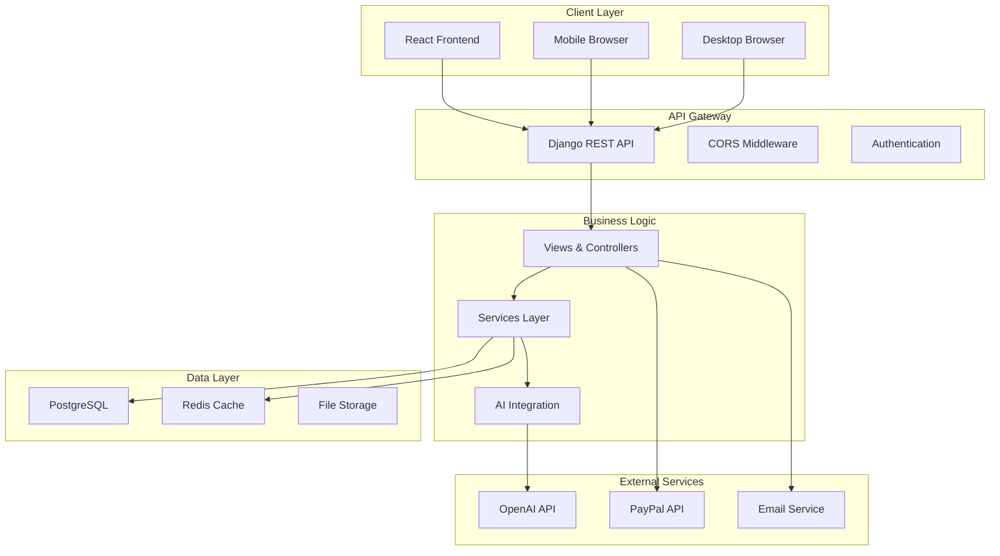
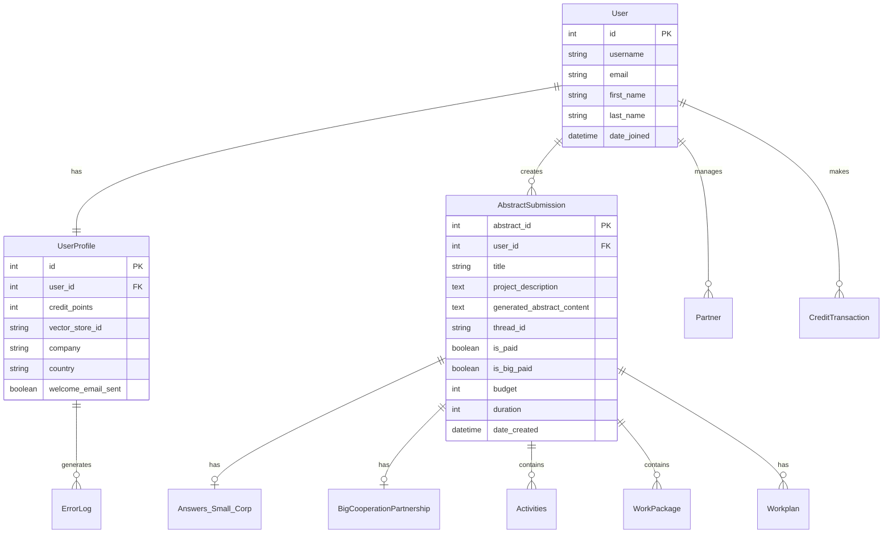

# Developer Guide - Get Your Grant

This guide provides comprehensive information for developers working on the Get Your Grant application, covering architecture, code structure, development practices, and contribution guidelines.

## Table of Contents

- [Architecture Overview](#architecture-overview)
- [Backend Structure](#backend-structure)
- [Frontend Structure](#frontend-structure)
- [Database Design](#database-design)
- [AI Integration](#ai-integration)
- [Development Workflow](#development-workflow)
- [Testing Strategy](#testing-strategy)
- [Code Standards](#code-standards)
- [Deployment Process](#deployment-process)
- [Contributing Guidelines](#contributing-guidelines)
- [Performance Considerations](#performance-considerations)
- [Security Guidelines](#security-guidelines)

## Architecture Overview

### System Architecture



### Technology Stack

**Backend:**
- **Framework**: Django 5.1
- **Database**: PostgreSQL 12+
- **Cache**: Redis
- **Task Queue**: Celery (recommended)
- **API**: Django REST Framework
- **Authentication**: Session-based with CSRF

**Frontend:**
- **Framework**: React 18
- **Language**: TypeScript
- **Build Tool**: Vite
- **State Management**: React Query + Zustand (recommended)
- **UI Framework**: Bootstrap 5
- **HTTP Client**: Axios

**AI & External Services:**
- **AI Provider**: OpenAI GPT-4
- **Payment**: PayPal SDK
- **Email**: SMTP (Gmail)
- **Monitoring**: Langfuse

## Backend Structure

### Project Layout

```
pschool-master/
├── manage.py                 # Django management script
├── requirements.txt          # Python dependencies
├── .env.sample              # Environment template
├── reactexpert/             # Django project settings
│   ├── __init__.py
│   ├── settings.py          # Main configuration
│   ├── urls.py              # Root URL configuration
│   ├── wsgi.py              # WSGI application
│   └── asgi.py              # ASGI application
├── assistant/               # Main application
│   ├── models.py            # Database models
│   ├── views.py             # API endpoints
│   ├── urls.py              # URL routing
│   ├── forms.py             # Form definitions
│   ├── admin.py             # Admin interface
│   ├── openai_methods.py    # AI integration
│   ├── questions.py         # Question structures
│   ├── send_emails.py       # Email utilities
│   ├── signals.py           # Django signals
│   ├── middleware.py        # Custom middleware
│   └── migrations/          # Database migrations
├── files/                   # File management app
├── helpers/                 # Utility functions
├── static/                  # Static files
└── templates/               # HTML templates
```

### Key Components

#### Models (`assistant/models.py`)

**Core Models:**
```python
class AbstractSubmission(models.Model):
    """Main project/proposal model"""
    user = models.ForeignKey(User, on_delete=models.CASCADE)
    title = models.CharField(max_length=999)
    project_description = models.TextField()
    generated_abstract_content = models.TextField()
    thread_id = models.CharField(max_length=999)  # OpenAI thread
    is_paid = models.BooleanField(default=False)
    budget = models.IntegerField()
    duration = models.IntegerField()
    
class UserProfile(models.Model):
    """Extended user information"""
    user = models.OneToOneField(User, on_delete=models.CASCADE)
    credit_points = models.IntegerField(default=0)
    vector_store_id = models.CharField(max_length=999)  # OpenAI vector store
    company = models.CharField(max_length=255)
    
class Activities(models.Model):
    """Project activities for small partnerships"""
    abstract = models.ForeignKey(AbstractSubmission, on_delete=models.CASCADE)
    activityTitle = models.CharField(max_length=1555)
    activityEstimatedStartDate = models.CharField(max_length=1555)
    activityEstimatedEndDate = models.CharField(max_length=1555)
```

#### Views (`assistant/views.py`)

**API Endpoint Structure:**
```python
# Authentication endpoints
@csrf_exempt
def register(request):
    """User registration with automatic profile creation"""
    
@csrf_exempt  
def login_view(request):
    """Session-based authentication"""

# Project management
@login_required
def add_abstract_new(request):
    """Create new project with AI generation"""
    
@login_required
def view_submission(request, submission_id):
    """Get project details with credit deduction"""

# AI integration
@login_required
def generate_answer_for_question(request, abstract_id, question_id, tab_id):
    """Generate AI responses for proposal sections"""
    
def ask_assistant(abstract_id, user, prompt):
    """Core AI interaction function"""
```

#### AI Integration (`assistant/openai_methods.py`)

**OpenAI Client Setup:**
```python
from langfuse.openai import OpenAI

client = OpenAI(api_key=os.getenv('OPENAI_API_KEY'))

def upload_file_vector_store(vector_store_id: str, file) -> VectorStoreFile:
    """Upload files to OpenAI vector store"""
    
def delete_file_vector_store(vector_store_id: str, file_id: str) -> bool:
    """Remove files from vector store"""
```

### URL Configuration

**Main URLs (`reactexpert/urls.py`):**
```python
urlpatterns = [
    path('admin/', admin.site.urls),
    path('assistant/', include('assistant.urls')),
    path('files/', include('files.urls')),
]
```

**Assistant URLs (`assistant/urls.py`):**
```python
urlpatterns = [
    # Authentication
    path('register/', views.register, name='register'),
    path('login/', views.login_view, name='login'),
    
    # Projects
    path('', views.list_abstracts, name='list_abstracts'),
    path('add_abstract_new/', views.add_abstract_new, name='add_abstract_new'),
    
    # AI Generation
    path('generate-answer/<int:abstract_id>/<int:question_id>/<int:tab_id>/', 
         views.generate_answer_for_question, name='generate_answer'),
    
    # Payments
    path('checkout/', views.payment_checkout, name='checkout_payment'),
    path('create_payment/', views.create_payment, name='create_payment'),
]
```

## Frontend Structure

### Project Layout

```
project-school-front-end-main/
├── package.json             # Dependencies and scripts
├── vite.config.ts          # Vite configuration
├── tsconfig.json           # TypeScript configuration
├── index.html              # Entry HTML
├── public/                 # Static assets
└── src/
    ├── main.tsx            # Application entry point
    ├── vite-env.d.ts       # Vite type definitions
    ├── app/
    │   ├── App.tsx         # Root component
    │   ├── routing/        # Route configuration
    │   ├── modules/        # Feature modules
    │   │   ├── auth/       # Authentication
    │   │   ├── api/        # API integration
    │   │   ├── errors/     # Error handling
    │   │   └── utils/      # Utilities
    │   ├── pages/          # Page components
    │   ├── contexts/       # React contexts
    │   └── hooks/          # Custom hooks
    ├── lib/                # External libraries
    └── assets/             # Styles and assets
```

### Key Components

#### API Integration (`src/app/modules/api/`)

**Core API Client:**
```typescript
// core.ts
export class Request {
  static post<R>(url: string, data?: any, config?: AxiosRequestConfig): Promise<AxiosResponse<R>> {
    return axios.post(url, data, {
      headers: { "x-csrftoken": getCSRFTokenFromStorage(), ...config?.headers },
      ...config,
    });
  }
  
  static get<T>(url: string, config?: AxiosRequestConfig): Promise<AxiosResponse<T>> {
    return axios.get(url, {
      headers: { "x-csrftoken": getCSRFTokenFromStorage(), ...config?.headers },
      ...config,
    });
  }
}
```

**React Query Setup:**
```typescript
export const queryClient = new QueryClient({
  defaultOptions: {
    queries: {
      refetchInterval: 300000,
      refetchIntervalInBackground: false,
      refetchOnReconnect: true,
      refetchOnWindowFocus: true,
      refetchOnMount: true,
    },
  },
});
```

#### Authentication (`src/app/modules/auth/`)

**Auth Context:**
```typescript
interface AuthContextType {
  currentUser: User | null;
  login: (credentials: LoginCredentials) => Promise<void>;
  logout: () => void;
  register: (userData: RegisterData) => Promise<void>;
}

export const AuthProvider: FC<{ children: ReactNode }> = ({ children }) => {
  const [currentUser, setCurrentUser] = useState<User | null>(null);
  
  // Implementation details...
  
  return (
    <AuthContext.Provider value={{ currentUser, login, logout, register }}>
      {children}
    </AuthContext.Provider>
  );
};
```

#### Routing (`src/app/routing/`)

**Route Structure:**
```typescript
export const AppRoutes: FC = () => {
  const { currentUser } = useAuth();

  return (
    <BrowserRouter>
      <Routes>
        <Route element={<App />}>
          {currentUser ? (
            <Route path="/*" element={<PrivateRoutes />} />
          ) : (
            <Route path="auth/*" element={<AuthPage />} />
          )}
        </Route>
      </Routes>
    </BrowserRouter>
  );
};
```

## Database Design

### Entity Relationship Diagram



### Key Relationships

1. **User ↔ UserProfile**: One-to-one relationship with extended user information
2. **User ↔ AbstractSubmission**: One-to-many relationship for project ownership
3. **AbstractSubmission ↔ Activities**: One-to-many for small partnership activities
4. **AbstractSubmission ↔ WorkPackage**: One-to-many for big partnership work packages
5. **User ↔ Partner**: One-to-many for partner management

### Database Indexes

**Performance Optimization:**
```python
class AbstractSubmission(models.Model):
    # ... fields ...
    
    class Meta:
        indexes = [
            models.Index(fields=['user', 'date_created']),
            models.Index(fields=['user', 'is_paid']),
            models.Index(fields=['is_paid', 'is_big_paid']),
        ]
```

## AI Integration

### OpenAI Architecture

**Thread Management:**
```python
def ask_assistant(abstract_id, user, prompt: str):
    """Core AI interaction with thread management"""
    user_profile = UserProfile.objects.get(user=user)
    abstract = AbstractSubmission.objects.get(abstract_id=abstract_id, user=user)
    
    # Create or reuse thread
    if abstract.thread_id is None:
        thread = client.beta.threads.create(
            tool_resources={
                "file_search": {
                    "vector_store_ids": [user_profile.vector_store_id]
                }
            }
        )
        abstract.thread_id = thread.id
        abstract.save()
    
    # Send message and get response
    client.beta.threads.messages.create(
        thread_id=abstract.thread_id,
        role="user",
        content=prompt
    )
    
    run = client.beta.threads.runs.create(
        thread_id=abstract.thread_id,
        assistant_id=ASSISTANT_ID
    )
    
    # Poll for completion
    while run.status in ["queued", "in_progress"]:
        time.sleep(1)
        run = client.beta.threads.runs.retrieve(
            thread_id=abstract.thread_id,
            run_id=run.id
        )
    
    # Extract response
    response_messages = client.beta.threads.messages.list(thread_id=abstract.thread_id)
    return response_messages.data[0].content[0].text.value
```

### Vector Store Management

**File Upload Process:**
```python
def upload_file_vector_store(vector_store_id: str, file) -> VectorStoreFile:
    """Upload partner documents to vector store"""
    # Create file in OpenAI
    response = client.files.create(
        file=file,
        purpose="assistants",
        timeout=45
    )
    
    # Add to vector store
    vector_store_response = client.beta.vector_stores.files.create_and_poll(
        vector_store_id=vector_store_id,
        file_id=response.id
    )
    
    return vector_store_response
```

### Prompt Engineering

**Structured Prompts:**
```python
def generate_structured_prompt(abstract, question_text, answering_structure):
    """Create structured prompts for consistent AI responses"""
    return f"""
    Please fill in the following fields, and make sure your answer can be read by json.loads() method:
    {{
        "title": "{abstract.title}",
        "acronym": "{abstract.acronym}",
        "topic_area_sector": "{abstract.topic_area_sector}",
        "scope_objective": "{abstract.scope_objective}",
        "actions_activities": "{abstract.actions_activities}",
        "keywords": "{abstract.keywords}",
        "generated_abstract": "{abstract.generated_abstract_content}",
        "question": "{question_text}",
        "answer": {{
            "answer_size": "IMPORTANT! answer key's value must be minimum 3000 characters",
            "answer_structure": {answering_structure},
            "answer": ""
        }}
    }}
    """
```

## Development Workflow

### Local Development Setup

1. **Backend Setup:**
```bash
cd pschool-master
python -m venv venv
source venv/bin/activate  # Windows: venv\Scripts\activate
pip install -r requirements.txt
cp .env.sample .env
# Edit .env with your configuration
python manage.py migrate
python manage.py runserver
```

2. **Frontend Setup:**
```bash
cd project-school-front-end-main/project-school-front-end-main
npm install
npm run dev
```

3. **Database Setup:**
```bash
# Create PostgreSQL database
createdb getyourgrant_dev
python manage.py migrate
python manage.py createsuperuser
```

### Git Workflow

**Branch Strategy:**
```
main                    # Production branch
├── develop            # Development branch
├── feature/ai-upgrade # Feature branches
├── bugfix/auth-issue  # Bug fix branches
└── hotfix/security    # Hotfix branches
```

**Commit Convention:**
```
feat: add new AI model integration
fix: resolve authentication timeout issue
docs: update API documentation
style: format code according to PEP8
refactor: restructure AI prompt generation
test: add unit tests for payment processing
chore: update dependencies
```

### Development Commands

**Backend:**
```bash
# Run development server
python manage.py runserver

# Create migrations
python manage.py makemigrations

# Apply migrations
python manage.py migrate

# Create superuser
python manage.py createsuperuser

# Run tests
python manage.py test

# Collect static files
python manage.py collectstatic

# Django shell
python manage.py shell
```

**Frontend:**
```bash
# Development server
npm run dev

# Build for production
npm run build

# Preview production build
npm run preview

# Lint code
npm run lint

# Type checking
npm run type-check
```

## Testing Strategy

### Backend Testing

**Test Structure:**
```python
# tests/test_models.py
from django.test import TestCase
from django.contrib.auth.models import User
from assistant.models import AbstractSubmission, UserProfile

class AbstractSubmissionTestCase(TestCase):
    def setUp(self):
        self.user = User.objects.create_user(
            username='testuser',
            email='test@example.com',
            password='testpass123'
        )
        
    def test_abstract_creation(self):
        abstract = AbstractSubmission.objects.create(
            user=self.user,
            title='Test Project',
            project_description='Test description'
        )
        self.assertEqual(abstract.title, 'Test Project')
        self.assertFalse(abstract.is_paid)

# tests/test_views.py
from django.test import TestCase, Client
from django.urls import reverse
import json

class APITestCase(TestCase):
    def setUp(self):
        self.client = Client()
        self.user = User.objects.create_user(
            username='testuser',
            password='testpass123'
        )
        
    def test_login_required(self):
        response = self.client.get(reverse('list_abstracts'))
        self.assertEqual(response.status_code, 302)  # Redirect to login
        
    def test_create_abstract(self):
        self.client.login(username='testuser', password='testpass123')
        data = {
            'why': 'Test motivation',
            'what': 'Test deliverables', 
            'how': 'Test methodology'
        }
        response = self.client.post(
            reverse('add_abstract_new'),
            json.dumps(data),
            content_type='application/json'
        )
        self.assertEqual(response.status_code, 200)
```

**AI Integration Testing:**
```python
# tests/test_ai_integration.py
from unittest.mock import patch, MagicMock
from assistant.openai_methods import ask_assistant

class AIIntegrationTestCase(TestCase):
    @patch('assistant.openai_methods.client')
    def test_ask_assistant_success(self, mock_client):
        # Mock OpenAI responses
        mock_client.beta.threads.create.return_value = MagicMock(id='thread_123')
        mock_client.beta.threads.runs.create.return_value = MagicMock(
            id='run_123', 
            status='completed'
        )
        mock_client.beta.threads.messages.list.return_value = MagicMock(
            data=[MagicMock(content=[MagicMock(text=MagicMock(value='{"test": "response"}'))])]
        )
        
        result = ask_assistant(1, self.user, "test prompt")
        self.assertIsNotNone(result)
```

### Frontend Testing

**Component Testing:**
```typescript
// tests/components/ProjectForm.test.tsx
import { render, screen, fireEvent } from '@testing-library/react'
import { ProjectForm } from '../components/ProjectForm'

describe('ProjectForm', () => {
  test('renders form fields', () => {
    render(<ProjectForm />)
    
    expect(screen.getByLabelText(/project title/i)).toBeInTheDocument()
    expect(screen.getByLabelText(/description/i)).toBeInTheDocument()
    expect(screen.getByRole('button', { name: /create/i })).toBeInTheDocument()
  })
  
  test('submits form with valid data', async () => {
    const mockSubmit = jest.fn()
    render(<ProjectForm onSubmit={mockSubmit} />)
    
    fireEvent.change(screen.getByLabelText(/title/i), {
      target: { value: 'Test Project' }
    })
    
    fireEvent.click(screen.getByRole('button', { name: /create/i }))
    
    expect(mockSubmit).toHaveBeenCalledWith({
      title: 'Test Project'
    })
  })
})
```

**API Testing:**
```typescript
// tests/api/projects.test.ts
import { Request } from '../src/app/modules/api/core'

describe('Projects API', () => {
  test('creates new project', async () => {
    const mockResponse = {
      status: 'success',
      abstract_id: 123
    }
    
    jest.spyOn(Request, 'post').mockResolvedValue({
      data: mockResponse
    } as any)
    
    const result = await Request.post('/assistant/add_abstract_new/', {
      why: 'Test',
      what: 'Test',
      how: 'Test'
    })
    
    expect(result.data).toEqual(mockResponse)
  })
})
```

## Code Standards

### Python/Django Standards

**PEP 8 Compliance:**
```python
# Good
class AbstractSubmission(models.Model):
    """Model representing a grant proposal submission."""
    
    user = models.ForeignKey(
        settings.AUTH_USER_MODEL,
        on_delete=models.CASCADE,
        related_name='abstracts'
    )
    title = models.CharField(max_length=999, blank=True, null=True)
    
    def __str__(self):
        return self.title or "Untitled Abstract"
    
    def get_absolute_url(self):
        return reverse('abstract_detail', kwargs={'pk': self.pk})

# Bad
class abstractSubmission(models.Model):
    user=models.ForeignKey(User,on_delete=models.CASCADE)
    title=models.CharField(max_length=999,blank=True,null=True)
    def __str__(self):return self.title
```

**View Structure:**
```python
@login_required
@require_http_methods(["POST"])
@transaction.atomic
def create_project(request):
    """Create a new project with AI generation."""
    try:
        data = json.loads(request.body.decode("utf-8"))
        
        # Validate input
        if not all(key in data for key in ['why', 'what', 'how']):
            return JsonResponse({
                'status': 'error',
                'message': 'Missing required fields'
            }, status=400)
        
        # Business logic
        project = ProjectService.create_project(request.user, data)
        
        return JsonResponse({
            'status': 'success',
            'project_id': project.id
        })
        
    except Exception as e:
        logger.error(f"Project creation failed: {str(e)}")
        return JsonResponse({
            'status': 'error',
            'message': 'Internal server error'
        }, status=500)
```

### TypeScript/React Standards

**Component Structure:**
```typescript
// Good
interface ProjectCardProps {
  project: Project;
  onEdit: (id: number) => void;
  onDelete: (id: number) => void;
}

export const ProjectCard: FC<ProjectCardProps> = ({ 
  project, 
  onEdit, 
  onDelete 
}) => {
  const handleEdit = useCallback(() => {
    onEdit(project.id);
  }, [project.id, onEdit]);

  return (
    <div className="project-card">
      <h3>{project.title}</h3>
      <p>{project.description}</p>
      <button onClick={handleEdit}>Edit</button>
    </div>
  );
};

// Bad
export const ProjectCard = (props) => {
  return (
    <div>
      <h3>{props.project.title}</h3>
      <button onClick={() => props.onEdit(props.project.id)}>Edit</button>
    </div>
  );
};
```

**API Integration:**
```typescript
// Good
interface CreateProjectRequest {
  why: string;
  what: string;
  how: string;
}

interface CreateProjectResponse {
  status: 'success' | 'error';
  project_id?: number;
  message?: string;
}

export const useCreateProject = () => {
  return useMutation<CreateProjectResponse, Error, CreateProjectRequest>({
    mutationFn: async (data) => {
      const response = await Request.post<CreateProjectResponse>(
        '/assistant/add_abstract_new/',
        data
      );
      return response.data;
    },
    onSuccess: (data) => {
      queryClient.invalidateQueries(['projects']);
    },
  });
};

// Bad
export const createProject = (data) => {
  return Request.post('/assistant/add_abstract_new/', data);
};
```

### Code Quality Tools

**Backend:**
```bash
# Install development dependencies
pip install black isort flake8 mypy

# Format code
black .
isort .

# Lint code
flake8 .

# Type checking
mypy .
```

**Frontend:**
```bash
# Install development dependencies
npm install -D eslint prettier @typescript-eslint/parser

# Format code
npx prettier --write .

# Lint code
npx eslint . --ext .ts,.tsx

# Type checking
npx tsc --noEmit
```

## Deployment Process

### Production Deployment

**Docker Configuration:**
```dockerfile
# Backend Dockerfile
FROM python:3.11-slim

WORKDIR /app

COPY requirements.txt .
RUN pip install --no-cache-dir -r requirements.txt

COPY . .

RUN python manage.py collectstatic --noinput

EXPOSE 8000

CMD ["gunicorn", "--bind", "0.0.0.0:8000", "reactexpert.wsgi:application"]
```

**Environment Configuration:**
```bash
# Production environment variables
DEBUG=False
SECRET_KEY=production-secret-key
ALLOWED_HOSTS=api.getyourgrant.eu,localhost

# Database
PGNAME=production_db
PGUSER=production_user
PGPASSWORD=secure_password
PGHOST=db.example.com
PGPORT=5432

# External services
OPENAI_API_KEY=sk-production-key
PAYPAL_CLIENT_ID=live-client-id
PAYPAL_SECRET=live-secret
PAYPAL_TEST=False
```

### CI/CD Pipeline

**GitHub Actions:**
```yaml
name: Deploy to Production

on:
  push:
    branches: [main]

jobs:
  test:
    runs-on: ubuntu-latest
    steps:
      - uses: actions/checkout@v3
      
      - name: Set up Python
        uses: actions/setup-python@v4
        with:
          python-version: '3.11'
      
      - name: Install dependencies
        run: |
          pip install -r requirements.txt
          pip install pytest pytest-django
      
      - name: Run tests
        run: pytest
        
      - name: Security scan
        run: |
          pip install bandit safety
          bandit -r .
          safety check

  deploy:
    needs: test
    runs-on: ubuntu-latest
    if: github.ref == 'refs/heads/main'
    steps:
      - name: Deploy to Azure
        run: |
          # Azure deployment commands
```

## Contributing Guidelines

### Pull Request Process

1. **Fork and Branch**
   ```bash
   git checkout -b feature/new-feature
   ```

2. **Development**
   - Write code following style guidelines
   - Add tests for new functionality
   - Update documentation

3. **Testing**
   ```bash
   # Backend tests
   python manage.py test
   
   # Frontend tests
   npm test
   
   # Integration tests
   npm run test:e2e
   ```

4. **Code Review**
   - Create pull request
   - Address review feedback
   - Ensure CI passes

5. **Merge**
   - Squash commits if needed
   - Merge to develop branch
   - Deploy to staging for testing

### Code Review Checklist

**Functionality:**
- [ ] Code works as intended
- [ ] Edge cases handled
- [ ] Error handling implemented
- [ ] Performance considerations

**Code Quality:**
- [ ] Follows style guidelines
- [ ] Well-documented
- [ ] No code duplication
- [ ] Proper naming conventions

**Security:**
- [ ] Input validation
- [ ] Authentication checks
- [ ] No sensitive data exposure
- [ ] SQL injection prevention

**Testing:**
- [ ] Unit tests added
- [ ] Integration tests updated
- [ ] Test coverage maintained
- [ ] Manual testing completed

## Performance Considerations

### Backend Optimization

**Database Queries:**
```python
# Optimize with select_related and prefetch_related
def get_user_projects(user):
    return AbstractSubmission.objects.filter(
        user=user
    ).select_related(
        'user'
    ).prefetch_related(
        'activities',
        'work_packages',
        'answers_small_corp'
    ).order_by('-date_created')

# Use database indexes
class Meta:
    indexes = [
        models.Index(fields=['user', 'date_created']),
        models.Index(fields=['is_paid', 'date_created']),
    ]
```

**Caching Strategy:**
```python
from django.core.cache import cache

def get_cached_ai_response(prompt_hash):
    """Cache AI responses to reduce API calls"""
    cached_response = cache.get(f"ai_response_{prompt_hash}")
    if cached_response:
        return cached_response
    
    response = generate_ai_response(prompt)
    cache.set(f"ai_response_{prompt_hash}", response, 3600)  # 1 hour
    return response
```

### Frontend Optimization

**Code Splitting:**
```typescript
// Lazy load components
const ProjectEditor = lazy(() => import('./components/ProjectEditor'));
const PaymentModal = lazy(() => import('./components/PaymentModal'));

// Route-based splitting
const ProjectRoutes = lazy(() => import('./routes/ProjectRoutes'));
```

**Memoization:**
```typescript
const ProjectList = memo(({ projects, onEdit }: ProjectListProps) => {
  const sortedProjects = useMemo(() => {
    return projects.sort((a, b) => 
      new
